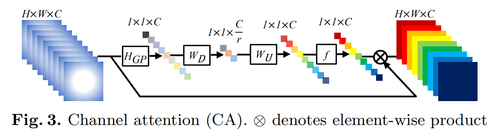

# 论文笔记
[TOC]
1. [SRCNN: Learning a Deep Convolutional Network for Image Super-Resolution](./Image Super-Resolution Using Deep.pdf)  
    unlike traditional methods that handle each component separately,
    our method jointly optimizes all layers. Our deep CNN has a lightweight structure, yet demonstrates state-of-the-art restoration quality,  
    and achieves fast speed for practical on-line usage.

   SRCNN performances better in certain channels, which is shown below
   
   
2. [FSRCNN: Accelerating the Super-Resolution Convolutional Neural Network](./Accelerating the Super-Resolution.pdf)  
   The proposed model achieves a speed up of more than 40 times with
   even superior restoration quality, which can achieve real-time performance on a generic 
   CPU while still maintaining good performance.
   the paper re-designs the SRCNN structure mainly in three aspects
   1. introduce a deconvolution layer at the end of the network, then the mapping 
      is learned directly from the original low-resolution image (without interpolation)
      to the high-resolution one  
   2. reformulate the mapping layer by shrinking the input feature dimension before mapping and
      expanding back afterwards   
   3. adopt smaller filter sizes but more mapping layers.   
   
   
   
3. ESPCN经典的pixel shuffle操作，后续会常用：Real-Time Single Image and Video Super-Resolution Using an Efficient Sub-Pixel Convolutional Neural Network  
   the paper demonstrates that performing SR in GR space is sub-optimal and adds computational
   complexity. So the paper propose a novel CNN architecture where the feature maps 
   are extracted in the LR space  
   The most significant work is the pixel shuffle, which reconstruct a feature map with 
   r^2 channels into a HR image which is r times larger
   
   
   
4. VDSR: Accurate Image Super-Resolution Using Very Deep Convolutional Networks  
   Ehe paper finds increasing their network depth shows a significant improvement 
   in accuracy. The paper applies 64filters of the size 3 x 3 x 64, where a filter
   operates on 3x 3 spatial region across 64 channels.
   
5. SRResNet & SRGAN: Photo-Realistic Single Image Super-Resolution Using a Generative Adversarial Network  
   The SR work recent focused on minimizing the mean squared reconstruction error
   but often lacking high-frequency details and are perceptually unsatisfying in the 
   sense that they fail to match the fidelity expected at the higher resolution.    
   So, the paper presents SRGAN and applies a perceptual loss function, which consists 
   of an adversarial loss and a content loss.
   And it introduces mean-opinion-score(MOS)MENA as test measure.
   
   
6. EDSR & MDSR: Enhanced Deep Residual Networks for Single Image Super-Resolution  
   The significant performance improvement of our model
   is due to optimization by removing unnecessary modules (Batch Normalization) in
   conventional residual networks, expanding the model size while stabilize the 
   training procedure and proposing a new multi-scale deep super-resolution system 
   and training method.
   
   
7. ESRGAN: Enhanced Super-Resolution Generative Adversarial Networks  
   The paper improves SRGAN network architecture, adversarial loss and perceptual
   loss.  
   1. introduces the Residual-in-Residual Dense Block(RRDB) without
      batch normalization as the basic network building unit  
   2. borrow the idea from relativistic GAN to let the discriminator predict
      relative realness instead of the absolute value  
   3. improve the perceptual loss by using the features before activation,
      which could provide stronger supervision for brightness consistency 
      and texture recovery
      
8. RCAN: Image Super-Resolution Using Very Deep Residual Channel Attention Networks  
   The paper notices that low-resolution inputs and features contain abundant
   low frequency information, which is treated equally across channels.  
   So the authors propose the very deep residual channel attention network(RCAN) formed
   by residual in residual(RIR) structure, which consists of several residual groups(RG)
   with long skip connections(LSC). Each residual group 
   contains some residual blocks with short skip connections(SSC).  
   Meanwhile, RIR allows abundant low-frequency information to be bypassed through 
   multiple skip connections, making the main network focus on learning 
   high-frequency information.  
   Furthermore, the paper proposes a channel attention mechanism to adaptively rescale 
   channel-wise features by considering interdependencies among channels.
   
   
9. SAN: Second-Order Attention Network for Single Image Super-Resolution  
   Recent work mainly focus on the single image super-resolution(SISR) with deeper
   or wider architecture design, neglecting the feature correlations of intermediate 
   layers. The paper raises 2 major limitations 
   1.  do not make full use of the information from the original LR images, 
       thereby resulting in relatively-low performance.  
   2.  rarely exploiting the inherent feature correlations in intermediate layers,
       thus hindering the representational ability of CNNs. 
       
   So the paper proposes a second order channel attention(SOCA) network, which 
   adaptively rescale the channel-wise features by
   using second-order feature statistics for more discriminative representations.    
   Furthermore, the paper proposes a non-locally
   enhanced residual group (NLRG) structure, which not only
   incorporates non-local operations to capture long-distance
   spatial contextual information, but also contains repeated local-source
   residual attention groups (LSRAG) to learn increasingly abstract feature representations.  
   In summary, the main contributions of this paper are listed as follows:  
   1. deep second-order attention network(SAN) for accurate image SR
   2. second-order channel attention (SOCA)mechanism to adaptively rescale 
      features by considering feature statistics higher than first-order
   3. non-locally enhanced residual group(NLRG) structure to build a deep network, 
      which further incorporates non-local operations to capture spatial contextual 
      information, and share-source residual group structure to learn deep features.
      
      
10. SA:Spatial Attention Network  
    early works were limited by the lack of ability to be spatially invariant to the input
    data in a computationally and parameter efficient manner. So the paper proposes a new 
    learnable module, the Spatial Transformer, which allows the spatial manipulation of data
    within the network.
    

11. CA:Squeeze-and-Excitation Networks  
    Early work focused more on the spatial component of the relationship between each layer,
    so this paper proposes "Squeeze-and-Excitation"(SE) block, which recalibrates channel-wise
    features.
    
    
12. CSA:Attention:Convolutional Block Attention Module  
    Given an intermediate feature map, the module that proposed by the paper sequentially 
    infers attention maps along two separate dimensions, channel and spatial, then the
    attention maps are multiplied to the input feature map for adaptive feature refinement.
    
    
13. A Deep Journey into Super-resolution: A survey  
    The paper introduces a taxonomy for deep-learning based SR networks that groups existing
    methods into 9 categories including linear, residual, multi-branch, recursive, progressive
    attention-based and adversarial designs. Besides, the paper provides comparisons between 
    the models in terms of f network complexity, memory footprint, model input and output, 
    learning details, the type of network losses and important architectural differences.
    This paper's main contribution:
    1. provide a thorough review of the recent techniques for image super-resolution
    2. introduce a new taxonomy of the SR algorithms based on their structural differences
    3. a comprehensive analysis is performed based on the number of parameters, algorithm
       settings, training details and important architectural innovations that leads to 
       significant performance improvements.
    4. provide a systematic evaluation of algorithms on six publicly available datasets for SISR
    5. discuss the challenges and provide insights into the possible future directions.
    
14. Efficient Image Super-Resolution Using Pixel Attention  
    Pixel attention (PA) is similar as channel attention and spatial attention in formulation.
    The difference is that PA produces 3D attention maps instead of a 1D attention 
    vector or a 2D map. This attention scheme introduces fewer additional parameters 
    but generates better SR results。  
    On the basis of PA, the paper proposes two building blocks(SC-PA blocks and U-PAblocks)
    for the main branch and the reconstruction branch, respectively.  
    The SC-PA branch is much more efficient than conventional residual/dense blocks, for
    its two-branch architecture and attention scheme.  
    The U-PA block combines the nearest-neighbor upsampling, convolution and PA layers.
    It improves the final reconstruction quality with little parameter cost.  
    The main contributions are following:  
    1. The paper proposes a simple and fundamental attention scheme – pixel attention(PA),
       which is demonstrated effective in lightweight SR networks.
    2. The paper integrates pixel attention and Self-Calibrated convolution in a new 
       building block – SC-PA, which is efficient and constructive.
    3. The paper employs pixel attention in the reconstruction branch and proposes a U-PA 
       block. Note that few studies have investigated attention schemes after upsampling.
    
    

15. Residual Non-local Attention Networks for Image Restoration  
    Previous methods are restricted by local convolutional operation and 
    channel-wise or spatial attention schema.
    To address this issue, the paper designs local and non-local attention blocks to 
    extract features that capture the long-range dependencies between pixels.  
    Specifically, we design trunk branch and (non-)local mask branch in each 
    (non-)local attention block.  
    Three issues are found following:  
    1. the receptive field size of previous networks are relatively small
    2. distinctive ability of these networks is also limited
    3. all channel-wise features are treated equally  
    
    So the paper makes three main contributions following:
    1. propose a very deep residual non-local networks
    2. propose residual non-local attention learning to train very deep networks by
       preserving more low-level features
    3. demonstrate with extensive experiments that our RNAN is powerful for various image
       restoration tasks
       
    
    
16. Single Image Super-Resolution via a Holistic Attention Network  
    Previous channel attention networks treat each convolution layer as a separate process
    that misses the correlation among different layers.To address this problem, the paper
    proposes a new holistic attention network(HAN) with layer attention modules(LAM) and
    channel-spatial attention modules(CSAM).  
    The main contributions are followings:
    1. propose a novel super-resolution algorithm named Holistic Attention Network
    2. introduce a layer attention module(CSAM)to learn weights for hierarchical features
    3. combine two attention modules above to improve th eST results by modeling informative
       features among hierarchical layers, channels and positions.
    
    
    
17. Non-Local Recurrent Network for Image Restoration  
    Previous the-state-of-art methods have shown non-local self-similarity in natural images
    to be an effective prior for image restoration, but it still remains unclear and challenging
    to make use of this intrinsic property via deep networks.
    The paper proposes a non-local recurrent network(NLRN) as the first attempt to incorporate
    non-local operations into a recurrent neural network(RNN) for image restoration.  
    The main contributions are followings:
    1. propose a non-local module that can be flexibly integrated into existing deep networks
    for end-to-end training
    2. fully employ the RNN structure for its parameter efficiency and allow deep features
    correlation to be propagated along adjacent recurrent states.
    3. show the importance to maintain a confined neighborhood for computing deep feature
    correlation given degraded images
       
    
18. Cross-Scale Internal Graph Neural Network for Image Super-Resolution  
    Previous methods only exploit similar patches within the same cale of the LR input image,
    neglecting potential HR cues from other scales.The paper explores the cross-scale patch 
    recurrence property of a natural image and proposes a novel cross-scale internal graph
    neural network(IGNN).  
    IGNN searches k-nearest neighboring patches in the downsampled LR image for each query patch
    in the LR image. Then IGNN obtains the corresponding k HR neighboring patches and recover 
    more details textures HR with the external information.
    
    
19. Interpreting Super-resolution Networks with local attention maps  
    SR networks inherit the mysterious nature of difficulty to interpret and little works 
    makes attempt to understand them.So the paper performs attribution analysis of ST networks,
    which aims to find the input pixels that strongly influence the SR results.  
    The paper proposes a novel attribution approach called local attribution map(LAM),
    which inherit the integral gradient image as the baseline input, and the other is to adopt 
    the progressive blurring function as the path function.  
    Based on LAM, the paper shows that:
    1. SR networks with wider range of involved input pixels could achieve better performance.
    2. Attention networks and non-local networks extract features from a wider range of input pixels.
    3. Comparing with the range that actually contributes, the receptive field is large enough for most deep networks
    4. For SR networks, textures with regular stripes or grids are more likely to be noticed, 
       while complex semantics are difficult to utilize
    
    Several auxiliary principles:
    1. the attribution should be conducted in local patches rather than global images.
    2. analyze patches that are difficult to reconstruct
    3. interpret the existence of specific features instead of pixel intensities
    
    Threefold benefits:
    1. Understanding the mechanism that underlies these SR networks would intuitively 
       tell us the effectiveness of the proposed method
    2. it would also have direct consequences on designing more efficient architectures.
    3. studying the interpretability of SR networks would also advance the science of
       deep learning applied to low-level vision tasks.
       
    
    
20. Pre-Trained Image Processing Transformer  
    pre-trained deep learning models (e.g., BERT, GPT-3) learned on large-scale 
    datasets have shown their effectiveness over conventional methods.
    So, the paper studies the low-level computer vision task (e.g., denoising, super-resolution and 
    deraining) and develop a new pre-trained model, namely, image processing transformer (IPT)  
    Pre-training is attractive by addressing the following 2 challenges:
    1. task-specific data can be limited
    2. it is unknown which type of image processing job will be requested until the test image 
       is presented.
       
    IPT architecture:
    1. __Head.__ use a multi-head architecture to deal with each task separately
    2. __Transformer encoder__  split the given features into patches
    3. __Transformer decoder.__  follows the same architecture and takes the output of decoder as input
    4. __Tails.__ use multi tails to deal with different tasks
    
    
    
21. RAM Residual Attention Module for Single Image Super-Resolution  
    Previous works applied Attention mechanism in the same way used in high-level CV problems
    without much consideration of the different nature between SR and other problems. So the 
    paper proposes Residual Attention Module(RAM) composed of CSA and fused attention.  
    In summary, the main contributions are following:
    1. propose two attention mechanisms (CA and SA) optimized for SR
    2. combine the two mechanisms and propose a residual attention module (RAM) based on ResNet
    3. build successfully both lightweight networks (aiming at efficiency) and heavy (very 
       deep) ones (aiming at high image quality), whereas existing methods focus only on one direction.
       
    
    
    
22. A Deep Convolutional Neural Network with Selection Units for Super-Resolution  

23. Video Super-Resolution Transformer  

24. Image Super-Resolution with Cross-Scale Non-Local Attention and Exhaustive Self-Exemplars Mining  

25. Image Super-Resolution With Non-Local Sparse Attention  

26. Attention in Attention Network for Image Super-Resolution  

27. Pyramid Attention Networks for Image Restoration  

